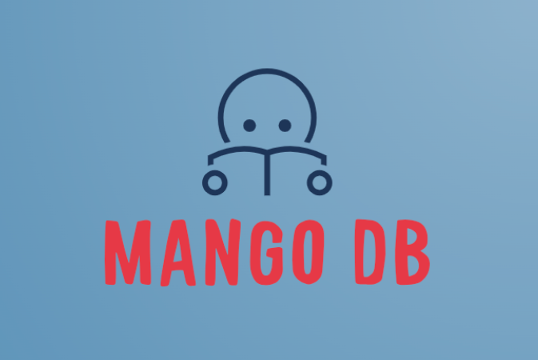

# Mango DB

Introducing **Mango DB**: Your one-stop solution to manage and expand your manga collection effortlessly. Create, update, and organize your bookmarked mangas all in one place!

[Mango DB Website](https://mango-db-do1p.onrender.com/)

## Technologies Used

This website was built using the following techonologies:

- JavaScript
- HTML
- CSS
- Node.JS
- Express.JS
- SQL / PSQL

## Getting Started

[Wireframe](https://www.figma.com/file/mATZ6B0C7LslsIloejHm2X/Manga-Website-Wireframe?type=design&node-id=0%3A1&mode=design&t=s8fSfj4N2eZ1xVt0-1)

[ERD](https://www.figma.com/file/sjk7ksrx4Qbw3B4u1NHao9/Manga-ERD?type=design&node-id=0%3A1&mode=design&t=eOaMmlQB4auBneSh-1)

[Trello](https://trello.com/invite/b/EN7qyYfW/ATTI791bc7cc52d2a065f471160a74a039bfDE6A2053/wireframe-erd)

## Ice-Box Items

This list is evergrowing, but here are some of the planned future updates:

- Include a way to search for Authors or Illustrator
- Display all mangas written by a specific Author
- Display all mangas drawn by a specific Illustrator
- In the "show-all" page, create a new category to store any Mangas that do not start with an Alphabetized character.
- Have users share their "Lists" to other platforms.

### Please feel free to share any feedback and suggestions you may have.